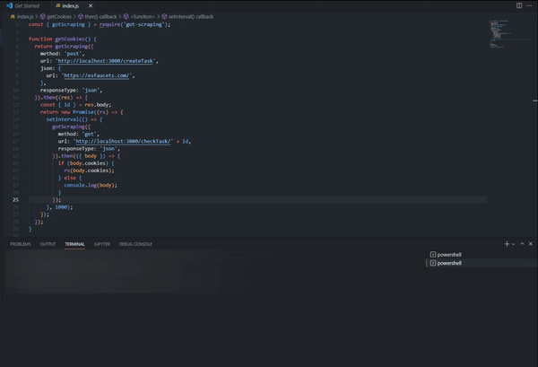

# Cloudflare-cookies-gen
`cf_clearance`, `rack.session`, `laravel_session` etc.. cloudflare cookies generator via headless browser (playwright).  
Headless browser uses little RAM, so it is convenient for running cloudflare scripts.  
This application runs a server that waits for a user request with certain parameters and returns a cookie or an error if the cookie could not be received.
<p align="center">
  
</p>  

## Features
- Headless mode
- Hcaptcha solver via [rucaptcha](https://rucaptcha.com/ "rucaptcha")([2captcha](https://2captcha.com/ "2captcha"))/[capmonster cloud](https://capmonster.cloud/ "capmonster cloud")

## Usage
```
git clone
npm install
npm run start
```
The server is now running and waiting for your requests


## Routes
> **POST**: http://localhost:3000/createTask  

JSON PAYLOAD:
```JSON
{
    "url": "https://domain.com/link-to-cloudfalre-page",
    "userAgent": "Mozilla/5.0 (Windows NT 10.0; Win64; x64) AppleWebKit/537.36 (KHTML, like Gecko) Chrome/105.0.0.0 Safari/537.36",
    "proxy": {
        "server": "http://myproxy.com:3128",
        "username": "usr",
        "password": "pwd"
    },
    "hcaptcha": ""
}
```
- **url** (required): Web page with cloudflare
- **userAgent**: User-Agent that is used in your project
- **proxy** (required): Proxy of your project. (If you do not want to use a proxy, remove the line `proxy: { server: 'per-context' }` from `browserOptions` in the `./utils/constants.js` file)
- **hcaptcha**: If the property is empty or not sent, the browser will expect to receive a token from the selected service when a captcha occurs on the cloudflare page. But if you have your own tokens (e.g., you use some tokens cache), you can send your token that will be used to solve the hcaptcha  
This route will return the task id: 
```JSON
{
    "id": 1665789881367
}
```  

> GET: http://localhost:3000/checkTask/:id 

(e.g http://localhost:3000/checkTask/1665789881367)  
While waiting, it returns:
```JSON
{
    "status": "waiting"
}
```
If it succeeds in getting cookies, it returns them:
```JSON
{
    "cookies": [
        "cf_clearance=uA...50; path=/; expires=Sun, 01-Oct-23 00:00:00 GMT; domain=.domain.com; HttpOnly; Secure; SameSite=None",
        "rack.session=BAh...1d; path=/; expires=Sun, 01 Oct 2023 00:00:00 GMT; HttpOnly; SameSite=Lax; secure"
    ],
    "status": "done",
    "time": "11.40"
}
```
If the timeout has expired, it returns:
```JSON
{
    "error": "Failed to get cookies: timeout"
}
```
If the task does not exist, it returns:
```JSON
{
    "error": "Task doesn't exist"
}
```
## Settings  
`./utils/constants.js`

- **CHECK_RESPONSE_TIMEOUT** - Cookie check frequency
- **CHECK_CAPCHA_TIMEOUT** - Frequency of checking if there is a captcha on the page
- **TASK_TIMEOUT** - Max time to get the cookies
- **defaultUserAgent** - It's understandable
- **CAPTCHA_METHOD** - (**CAPTCHA_SOLVER_RUCAPTCHA**/**CAPTCHA_SOLVER_CAPMONSTER**)
- **rucaptcha_apikey** / **capmonser_apikey** - Your api-key for the captcha-solving service
- **hcaptcha_sitekey** - Sitekey of your site for hcaptcha  

## How do I make the app always work?
Node.js runs in a particular process on your PC. When we press Ctrl+C, the process is terminated and the application stops working. To stop this from happening, you need to use a process manager. One of the most common is `pm2`:
```
npm install pm2 -g 
pm2 start index.js
```
Now if our application goes down, pm2 will pick it up.  
```pm2 kill``` - Completely disables the current PM2 and running applications.

## How else to pass cloudflare?  
You can use JSDOM(or something similar) and add to the NodeJS environment what the scripts lack. But then your environment gets so big that the script works "harder" than it should. In terms of RAM, using a headless browser is better

## Other
Cloudflare checks browser fingerprints, so it needs to consider a headless browser as a normal browser to successfully solve the challenge. Fortunately, cloudflare doesn't require much. The additional scripts to successfully pass the challange are in the `./scripts/overrides.js` file. There is nothing special there. To understand what cloudflare requires, [you just have to deobfuscate several versions of its script](https://github.com/rastvl/cloudflare-main-challenge-deobfuscator "deobfuscate").  
The project uses rucaptcha, but you can easily change this to 2captcha. As I understand it, these are the same guys. All you have to do is change the domains in two places in the `./libs/RucaptchaSolver.js` file.  


## TODO:
- Errors handlers
